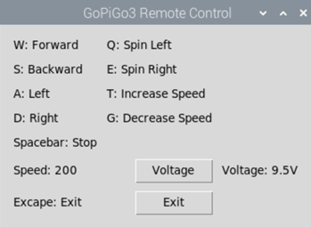
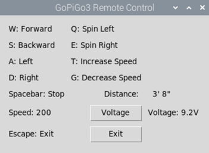
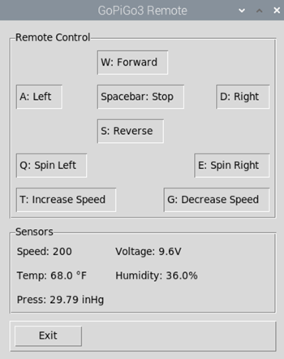

# Various iterations of GoPiGo3 remote control programs

1. rc_gui.py - Basic Tkinter remote control
2. rc_distance.py - Tkinter remote control with distance sensor
3. rc_bme280.py - Tkinter remote control, with Bosch BME280 Temperature, Humidity, and Pressure sensor and battery voltage display. The BME280 is read every 15 seconds using the 'after' method
4. rc_bme280_distance.py - Tkinter remote control with bme280 and distance sensor. [Not Implemented]
5. ps4_gopigo.py - Program or module to control the GoPiGo using a PS4 gamepad. This program does not have an interface.
6. rc_ps4_bme280.py - Adds the ps4 module to the rc_bme280.py program

rc_gui.py

rc_distance.py

rc_bme280.py

## Desktop Shortcuts

- RemoteGUI.desktop
- VideoPi.desktop
