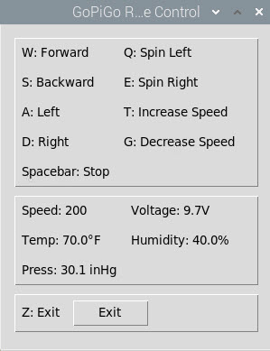

# GoPiGo3
GoPiGo3 Projects
### Projects
- OfficeCannon --> The GoPiGo3 launches soft missiles with Dream Cheeky Thunder
### Code
- rc_tkinter_bme280.py --> Tkinter remote control with bme280 sensor readings

### Purpose
I am an Information Technology Instructor at Western Nebraska Community College. I teach Information Technology Technical Support, CyberSecurity and Computer Science.

This repository is for my personal projects with the Raspberry Pi based Modular Robotics GoPiGo3. WNCC NASA GoPiGo3 projects are located at https://github.com/itinstructor/WNCCNASA
### License
 This work is licensed under a <a rel="license" href="http://creativecommons.org/licenses/by-nc-sa/4.0/">Creative Commons Attribution-NonCommercial-ShareAlike 4.0 International License</a>.

Copyright (c) 2021 William A Loring
