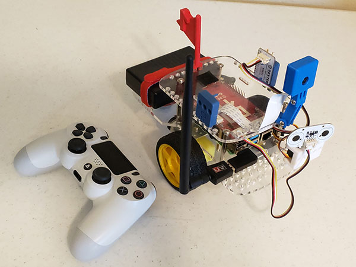
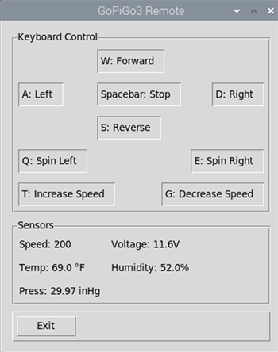
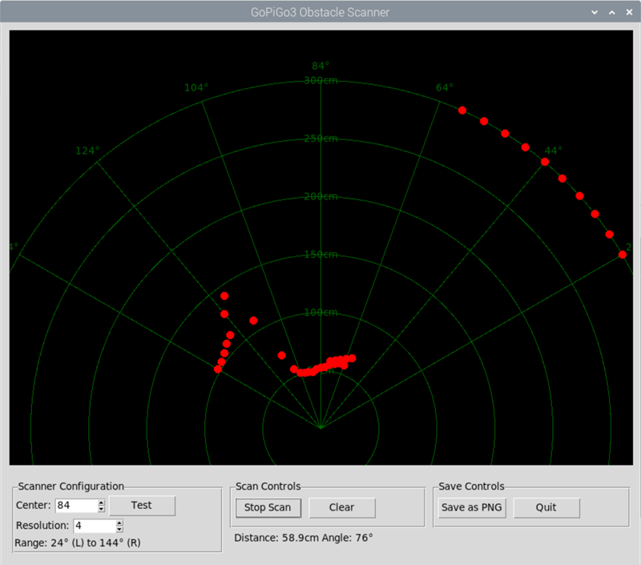

# GoPiGo3 & Raspberry Pi Projects

My GoPiGo3 with all its modifications.

## GoPiGo3 Code

- obstacle_scanner.py --> Tkinter visualization of area using distance sensor.
- radar_rich.py --> ASCII visualization of area using distance sensor and Python rich library.
- radar_cli.py --> ASCII visualization of area using distance sensor.
- ps4_gopigo.py --> Remote control with wireless PS4 game controller to Pi bluetooth. Also used as a library for GoPiGo3 remote control.
- rc_tkinter_bme280.py --> Tkinter remote control with bme280 sensor readings.
- bme280_test.py
- bme280_thingspeak.py --> Upload Temperature, Humidity and Barometric pressure to thingspeak.com
- bme280_tkinter.py
- pi_info_linux.py
- psutil_system_info.py
- rc_gui_ps4_bme280.py --> Uses ps4_gopigo.py as a module to run the joystick with gui and bme280. Screenshot below.
- video_pi.py --> Video streaming using Picam2 for Raspberry Pi Bullseye and Bookworm. Using the new libcamera2 camera stack.

Obstacle Scanner

## Documentation

- Threading folder contains a threading tutorial and example code. Threads allow the robot to do many tasks as a time.
- GoPiGo3 Pi Getting Started Bullseye Tutorial
- GoPiGo3 Getting Started Buster Tutorial
- GoPiGo3 Cloud Data with ThingSpeak Tutorial --> Upload sensor data to [thingspeak.com](https://www.thingspeak.com)
  - Go to [billthecomputerguy.com/gopigo](https://www.billthecomputerguy.com/gopigo) for example readings.
- GoPiGo3 Sensors Tutorial
- GoPiGo Tutorials
- Raspberry Pi Getting Started Buster, Bullseye, and Bookworm Tutorial
- Raspberry Pi Sensors

## Projects

- OfficeCannon --> The GoPiGo3 launches soft missiles with Dream Cheeky Thunder

## Credit

- setup_gopigo3_on_32-bit_Bullseye.sh is from [slowrunner](https://github.com/slowrunner) --> This shell script sets up the GoPiGo3 drivers for Bullseye 32 or 64 bit.

## Purpose

I am an Information Technology Instructor at Western Nebraska Community College. I teach Information Technology Technical Support, CyberSecurity and Computer Science.

This repository is for my personal projects and resources with the Raspberry Pi based Modular Robotics GoPiGo3.

WNCC NASA GoPiGo3 projects are located at https://github.com/itinstructor/WNCCNASA

## License

 This work is licensed under a <a rel="license" href="http://creativecommons.org/licenses/by-nc-sa/4.0/">Creative Commons Attribution-NonCommercial-ShareAlike 4.0 International License</a>.

Copyright (c) 2024 William A Loring
